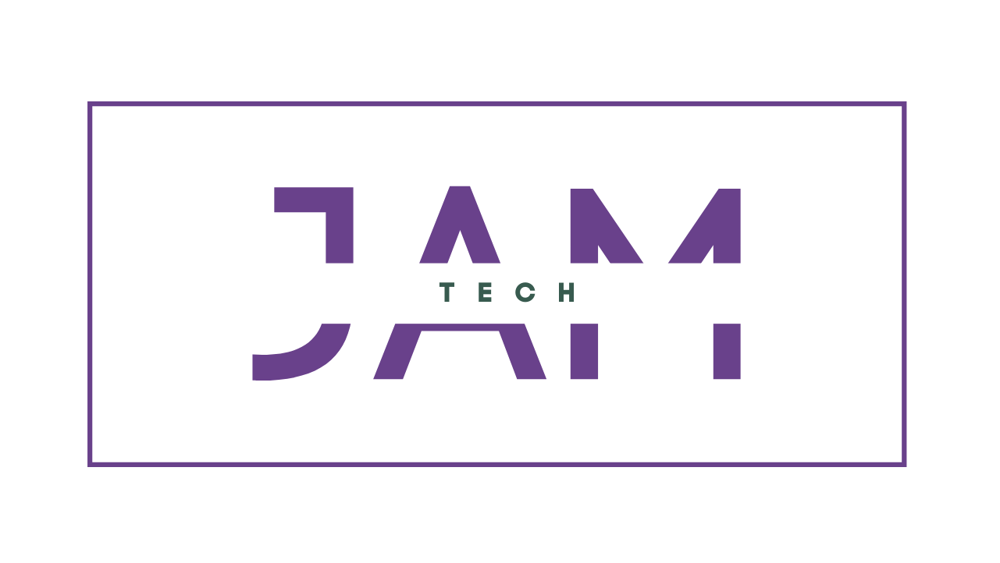

##COS 397 - 497 - UMaine Senior Capstone Project 
<!-- This next line is for rendering our team logo from the Logo directory -->

Hello! We are JamTech. Welcome to our Senior Capstone Project. 
This is a two-semester (Fall 2023 - Spring 2024) computer science capstone course at the University of Maine

 
**Members of JamTech:**

* Tristan Cilley<!-- Write your Name Below, use * for bullet point -->
* Maha Fazli
* Jacob Michaud
* Allison Lupien
* Nick Sarno

 
This README.md file shall serve as an introduction to the software development project we will develop over the course of the 2023-2024 academic year.

